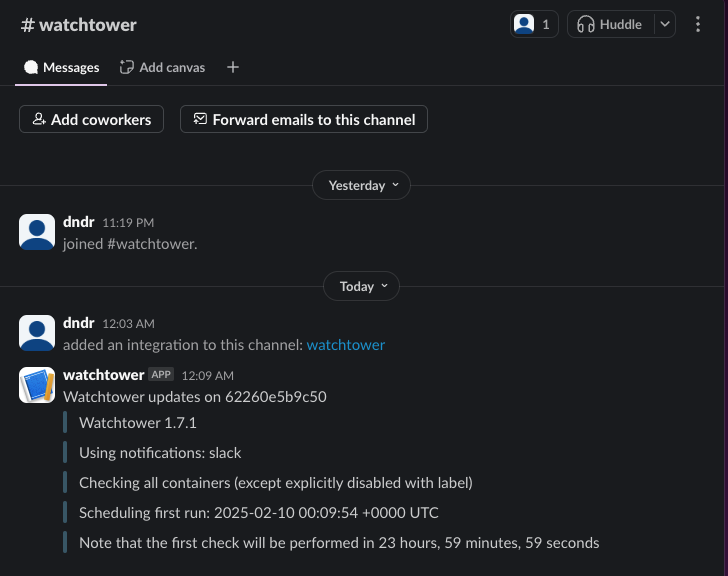

# Deploying Watchtower

Watchtower is a useful tool for automatically updating running (and stopped) Docker containers.

### Docker Compose
```yaml
watchtower:
  image: containrrr/watchtower
  volumes: 
    - /var/run/docker.sock:/var/run/docker.sock
  environment:
    - WATCHTOWER_SCHEDULE=0 0 12 * * *
    - WATCHTOWER_CLEANUP=true
  restart: unless-stopped
```

### Environment Variables
- `- WATCHTOWER_SCHEDULE`: Specifies the schedule for Watchtower to check for updates and update the images. Here, it checks for updates every day at 12PM. The schedule is defined using cron syntax.<br>
`0 0 12 * * *`: This example schedule means that Watchtower will check for updates every day at 12 PM. By default, watchtower will run every day around the time the container was created.
- `- WATCHTOWER_CLEANUP=true`: Automatically removes old images after updating.

Save the file and start the container with:
```bash
docker compose up -d
```

To check if the container is running:
```bash
docker ps
```

## (Optional) Setting up Slack notifications

Follow this <a href="https://api.slack.com/messaging/webhooks">guide</a> to create a webhook for slack notifications.

### Setting up notifications
Add the following environment variables to the docker compose file
```yaml
environment:
  - WATCHTOWER_NOTIFICATIONS=slack
  - WATCHTOWER_NOTIFICATION_SLACK_HOOK_URL="your-slack-webhook-url"
  - WATCHTOWER_NOTIFICATION_SLACK_IDENTIFIER=watchtower
```
Save and restart the container. You should see an update from watchtower in your slack channel like this:


## Conclusion

Watchtower will now keep the Docker containers up to date automatically. For more advanced configurations, refer to the [Watchtower documentation](https://containrrr.dev/watchtower/).